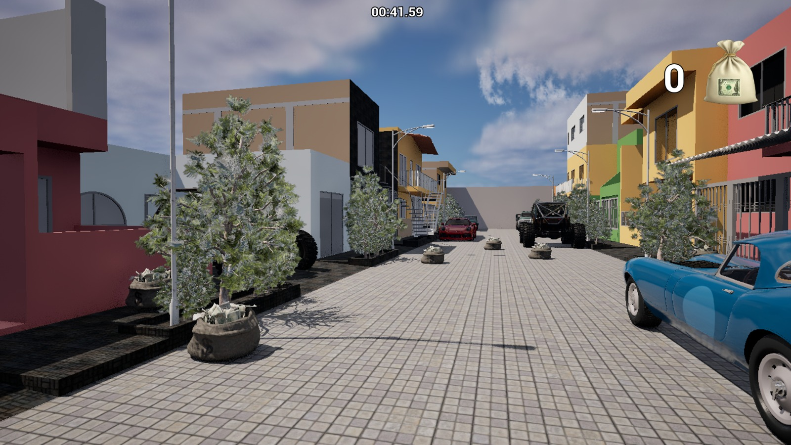
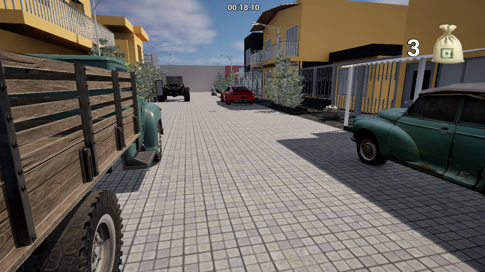

# GAME ON UNREAL ENGINE 5

## DESCRIPTION

his is a project just for educational purposes.

You just need to install the game on your phone, then press start to initialize the game, the following step is to enjoy finding 10 money bags so you win.

The game was created on unreal engine 5.

The main idea was to put in practice everything we have learned on class, on computer simulation.

It was an exiting proyect, with a lot of dificulties but I solve it and I'm proud for the result.

## GAME PICTURES

